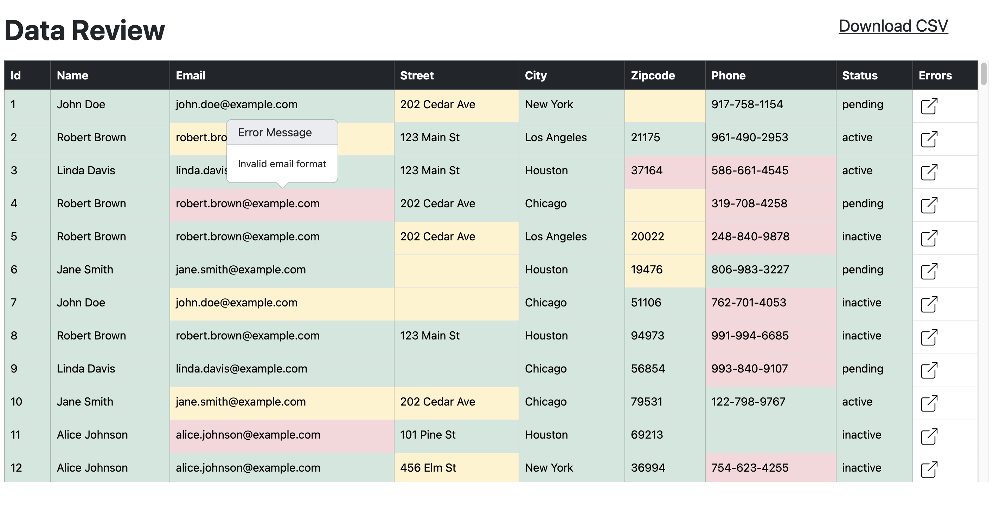
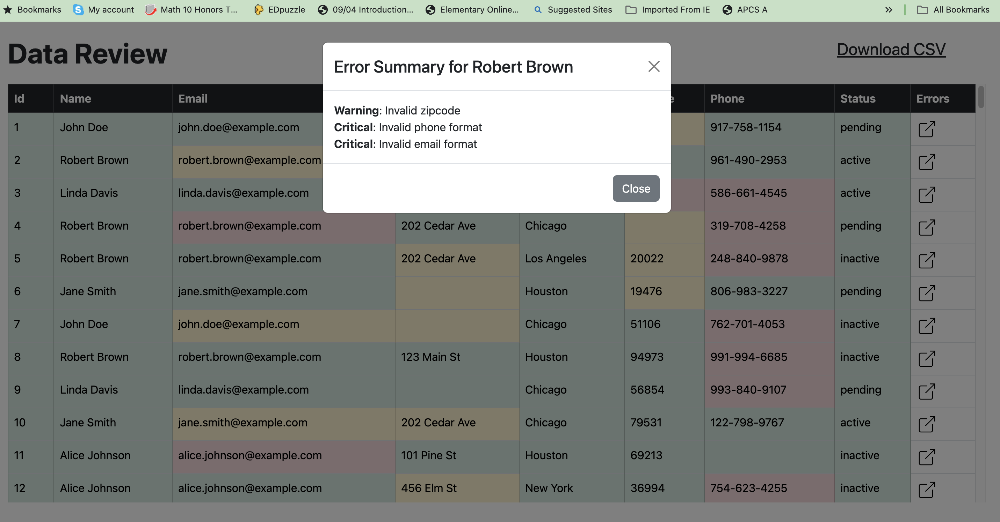
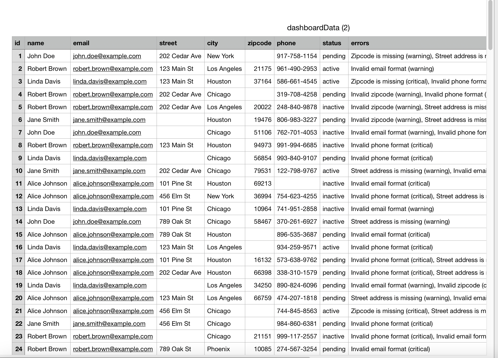

<a href="https://www.lume.ai" target="_blank">
  <picture>
    <source media="(prefers-color-scheme: dark)" srcset="/data-review-assignment/public/logo_title.png" style="max-width: 100%; width: 250px; margin-bottom: 20px">
    
  </picture>
</a>

<h3></h3>
 
---

### **Take-Home Assignment: Daniel Schwartz Approach, Assumptions, Improvements**

**Approach**: At my daily work I use Angular and Bootstrap, so I chose to use React Bootstrap as I thought I would already have some familiarity with the components supported by the library. In React, bootstrap works a bit different with the way components interact with each other, so I think in hindsight it may have been better to choose a different library. The first thing I implemented was the data query, which I setup using the fetch method in a useEffect hook. I did not see any fields in the mock data that were not flatened, so I did not do any major processing of the response. For the table, I used bootstrap and tried to pick color shadings of the cells that were not too overwhelming. The hoverable error messages went through a few iterations, I was not satisfied with the built in tooltips, so I used a popover, which I think displayed the errors more clearly, but it had some issues with its placement. For the modal, I used a popout icon in the error column of the table, which was clickable to display the modal. Lastly, the download csv link uses react-csv and simply creates a csv file called dashboardData.csv. Throughout the dashboard file, I used a few different helper components to separate different logics, and I created interfaces that represented the props for these components.

**Assumptions**: When thinking of a design for this dashboard, I envisoned the dashboard as a tool for validating data responses from APIs. I used a pastel color background for the cells, so that the severity level of the errors were quickly visible, while maintaining the readability of the data in each cell. For the export to csv functionality, I converted the errors to a string, so that they would show up properly.

**Improvements**: The biggest improvement I would work on given more time, would be to work on the popover tooltip more. I would have liked to further design this popover and potentially include icons to easily represent error severity and provide clarity. Additionally, I would also rework the component because the library I ended up using had some weird graphical glitches such as the inital placement of the popover not being set correctly. Also, I experimented with a few different color patterns for the table, and given more time I would probably change those as well.
